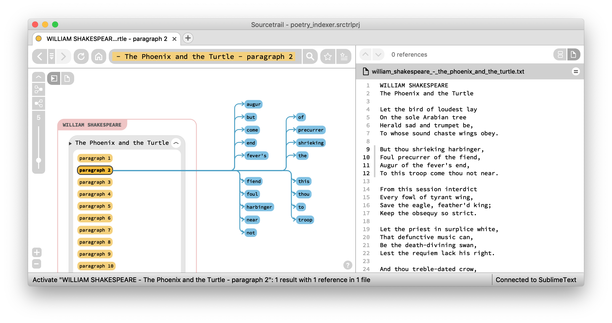
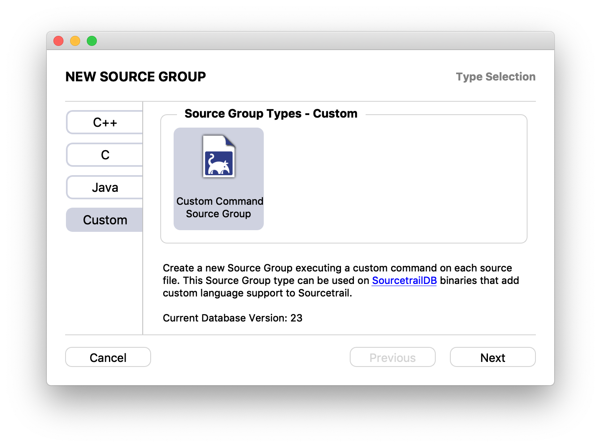
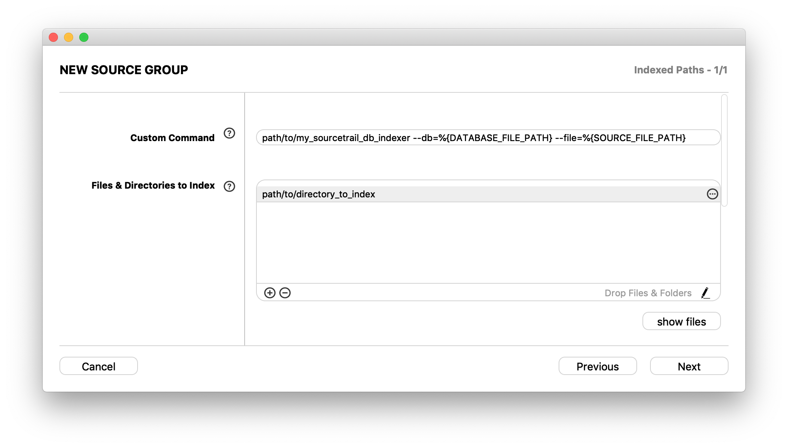
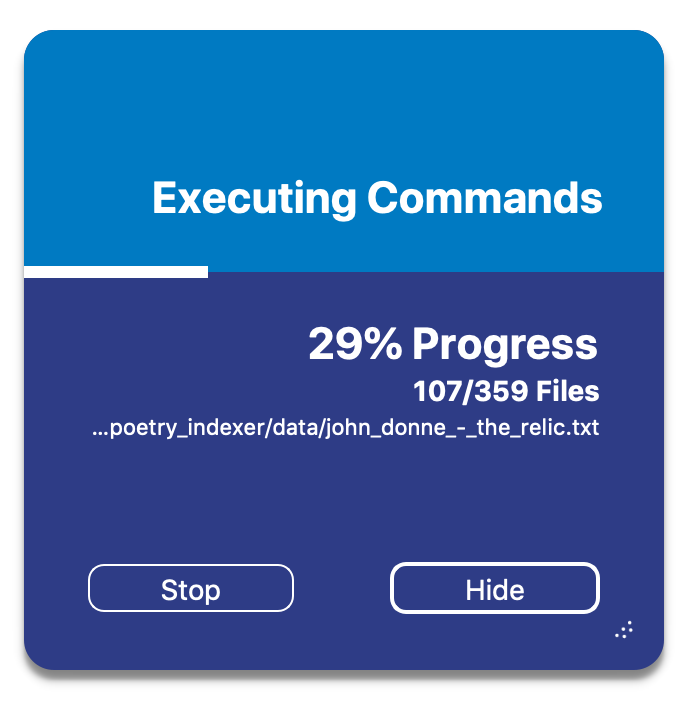

# SourcetrailDB

Library to export [Sourcetrail](https://www.sourcetrail.com/) compatible database files for writing custom indexers


## CI Pipelines

Windows: [](https://ci.appveyor.com/project/mlangkabel/sourcetraildb/branch/master)

Linux and macOS: [](https://travis-ci.com/CoatiSoftware/SourcetrailDB)


## Introduction

The SourcetrailDB project provides write access to [Sourcetrail](https://www.sourcetrail.com/) database files. You can use the SourcetrailDB project to write an indexer for an arbitrary programming language (or other kind of data, e.g. see [poetry indexer example](examples/cpp_poetry_indexer)) and export a Sourcetrail database file that can be viewed and navigated within Sourcetrail.




## Projects Using SourcetrailDB

The following list of projects already use SourcetrailDB API to extend the language support of Sourcetrail.
* [SourcetrailPythonIndexer](https://github.com/CoatiSoftware/SourcetrailPythonIndexer) is a Sourcetrail language extension that brings Python support to Sourcetrail. This project is in a stable state and it has a direct Sourcetrail integration via the Python Source Group.
* [SourcetrailDotnetIndexer](https://github.com/packdat/SourcetrailDotnetIndexer) is a Sourcetrail language extension that allows to index all kinds of .NET assemblies, regardless of the language they are created from (e.g. C#, VB.NET, ...). Because it does not (need to) know the source code, it does not provide any code snippets for the indexed assemblies, but it already works well at generating graphs.
* [SourcetrailPerlIndexer](https://github.com/xanni/SourcetrailPerlIndexer) is a Sourcetrail language extension that brings Perl support to Sourcetrail. This project is still in a prototype state, but you can already run it on your Perl code via the Custom Source Group.
* [stacktraceflow_sourcetrail](https://github.com/Baranowski/stacktraceflow_sourcetrail) combines the power of Valgrind and Sourcetrail to quickly produce interactive callgraph of software written in any language, as long as it's compiled to ELF/DWARF format (e.g. Rust and Go).
* [SourcetrailTypescriptIndexer](https://github.com/LouisStAmour/SourcetrailTypescriptIndexer) is a Typescript Indexer for Sourcetrail using the TypeScript compiler and node bindings contributed to SourcetrailDB (*prototype stage*).

## Adding new Language Support

When you plan on starting a Sourcetrail language package on your own, you can use whatever programming language you like for this task. The only requirement is: you need to make calls to SourectrailDB to enter the information your indexer records to the Sourcetrail database.

__To get an overview on everything involved, please take a look at our [Language Extension Guide](LANGUAGE_EXTENSION_GUIDE.md).__


## Supported Language Bindings

Even though the core implementation is written in C++, this does not require you to write your indexer in C++ as well. Instead you can use a language binding (e.g. see [SWIG](http://www.swig.org/)). These language bindings are already available:

* Perl (via [SWIG](http://www.swig.org/))
* Python (via [SWIG](http://www.swig.org/))
* Java (via [SWIG](http://www.swig.org/))
* C# (via [SWIG](http://www.swig.org/))

If the language of your choice is not covered by this list, feel free to [open an issue](https://github.com/CoatiSoftware/SourcetrailDB/issues) or provide a pull request.

## Versioning

The SourcetrailDB version format consists of three numbers in the format `vXX.dbYY.pZZ`.
* `XX`: interface version. This version increases on every change that breaks backwards compatibility.
* `YY`: Sourcetrail database version. This version needs to match the database version of the used Sourcetrail instance. You can find the database version of Sourcetrail in its About dialog.
* `ZZ`: patch number of the build. It will increase with every release that publishes bugfixes and features that don't break any compatibility.

You can find a complete list of available releases on the [GitHub release page](https://github.com/CoatiSoftware/SourcetrailDB/releases). If you are interested in the actual changes of every release, please take a look at the [Changelog](CHANGELOG.md).


## Contributing
If you like this project and want to get involved, there are lots of ways you can help:

* __Spread the word.__ The more people want this project to grow, the greater the motivation for the developers to get things done.
* __Write some code.__ Don't be shy here. You can implement whole new language bindings, add a features or fix some bugs, but you can also do some refactoring if you think that it benefits the readability or the maintainability of the code. Still, no matter if you just want to work on cosmetics or implement new features, it would be best if you create an issue here on the issue tracker before you actually start handing in pull requests, so that we can discuss those changes first and thus raise the probability that those changes will get pulled quickly.

To create a pull request, follow these steps:
* Fork the Repo on GitHub.
* Make your commits.
* If you added functionality or fixed a bug, please add a test.
* Add your name to the "Code Contributors" section in AUTHORS.txt file.
* Push to your fork and submit a pull request.


## Building

Take a look at [Appveyor (for Windows)](appveyor.yml) or [Travis (for Linux and macOs)](.travis.yml) CI scripts for reference.

### SourcetrailDB Core

Before building the core project, please make sure that you also have checked out the tags of this repository (they are relevant for deriving version number information during the build).

Requirements:
* [CMake](https://cmake.org/) >= 2.6
* C++-Compiler with C++11 support

To build the SourcetrailDB core library `libsourcetraildb.a`:

```
$ cd path/to/SourcetrailDB
$ mkdir build
$ cd build
$ cmake ..
$ make lib_core
```

To run the tests, just build and execute the test executable:

```
$ make test_core
$ ./core/test_core
```

### Perl Bindings

Requirements:
* [Perl](https://www.perl.org/) needs to be included and linked against when building the Perl bindings. CMake will auto-detect your Perl installation. If you want to build against a specific version of Perl, please define the `PERL_LIBRARY` variable accordingly when running CMake. Make sure to link to the correct Perl version when building for different architectures (32bit/64bit).

* [SWIG 3.0.12](http://www.swig.org/) is used to automatically generate Perl binding code. Make sure that SWIG is added to your path environment variable.

If you want to build the Perl bindings run:
```
$ cd path/to/SourcetrailDB
$ mkdir build
$ cd build
$ cmake -DBUILD_BINDINGS_PERL=ON ..
$ make sourcetraildb
```

Swig is configured to generate the Perl binding code as a pre-build event, so you don't need to bother with updating manually.

### Python Bindings

Requirements:
* [Python](https://www.python.org/) needs to be included and linked against when building the Python bindings. CMake will auto-detect your Python installation. If you want to build against a specific version of Python, please define the `PYTHON_LIBRARY` variable accordingly when running CMake. Make sure to link to the correct Python version when building for different architectures (32bit/64bit).

* [SWIG 3.0.12](http://www.swig.org/) is used to automatically generate Python binding code. Make sure that SWIG is added to your path environment variable.

If you want to build the Python bindings run:
```
$ cd path/to/SourcetrailDB
$ mkdir build
$ cd build
$ cmake -DBUILD_BINDINGS_PYTHON=ON ..
$ make _sourcetraildb
```

Swig is configured to generate the Python binding code as a pre-build event, so you don't need to bother with updating manually.

### Java Bindings

Requirements:
* [Java JDK](https://openjdk.java.net/) needs to be included and linked against when building the Java bindings. CMake will auto-detect your Java installation.

* [SWIG 3.0.12](http://www.swig.org/) is used to automatically generate Java binding code. Make sure that SWIG is added to your path environment variable.

If you want to build the Java bindings run:
```
$ cd path/to/SourcetrailDB
$ mkdir build
$ cd build
$ cmake -DBUILD_BINDINGS_JAVA=ON ..
$ make
```

Swig is configured to generate the Java binding code as a pre-build event, so you don't need to bother with updating manually.

### C# Bindings

Requirements:
* [SWIG 3.0.12](http://www.swig.org/) is used to automatically generate C# binding code. Make sure that SWIG is added to your path environment variable.

If you want to build the C# bindings run:
```
$ cd path/to/SourcetrailDB
$ mkdir build
$ cd build
$ cmake -DBUILD_BINDINGS_CSHARP=ON ..
$ make
```

### Examples

The examples help you to understand SourcetrailDB usage in practice. Please take a look at each examples README file for build and use instructions. Each example also provides a Sourcetrail project file `.srctrlprj` showing you how to use a custom indexer directly from Sourcetrail (see [Integrating with Sourcetrail](#integrating-with-sourcetrail)).

* [C++ API Example](examples/cpp_api_example)
* [C++ Poetry Indexer](examples/cpp_poetry_indexer)
* [Python API Example](examples/python_api_example)
* [Java API Example](examples/java_api_example)


## SourcetrailDB API

SourcetrailDB tries to keep the API for writing to the Sourcetrail database as simple as possible. For the C++ core take a look at the list of methods of the [SourcetrailDBWriter](core/include/SourcetrailDBWriter.h) class for a complete overview of the provided write API. If you are using bindings for other languages, the code may look different but the set of provided functionality should stay the same.


### Opening or Creating a Database

```c++
// create an instance of SourcetrailDBWriter
sourcetrail::SourcetrailDBWriter writer;

// open a database connection by passing a database file path (.srctrldb or .srctrldb_tmp)
// if the database file does not exist yet, it will be created in this location.
// a project file (.srctrlprj) will also be created, if it does not exist in this location.
writer.open("MyProject.srctrldb");

// record data...

// close the database connection.
writer.close();
```

### Recording a Symbol

```c++
sourcetrail::SourcetrailDBWriter writer;
writer.open("MyProject.srctrldb");

// records a named non-indexed symbol without type
writer.recordSymbol({ "::", { { "void", "foo", "()" } } });

writer.close();
```


### Recording Additional Symbol Information

```c++
sourcetrail::SourcetrailDBWriter writer;
writer.open("MyProject.srctrldb");

sourcetrail::NameHierarchy name = { "::", { { "void", "foo", "()" } } };

// the returned symbolId will be used to record further information for the symbol
int symbolId = writer.recordSymbol(name);

// recording a unique name multiple times will always return the same symbol id
assert(symbolId == writer.recordSymbol(name));

// set symbol "explicit" to remove the "non-indexed" state.
writer.recordSymbolDefinitionKind(symbolId, sourcetrail::DEFINITION_EXPLICIT);

// set type to turn the symbol into "function"
writer.recordSymbolKind(symbolId, sourcetrail::SYMBOL_FUNCTION);

writer.close();
```


### Recording Nested Symbol Names

```c++
sourcetrail::SourcetrailDBWriter writer;
writer.open("MyProject_3.srctrldb");

// create a name hierarchy
sourcetrail::NameHierarchy name;

// specify the delimiter string - in many languages names can be nested
name.nameDelimiter = "::";

// add a name element for the parent
sourcetrail::NameElement parentElement;
parentElement.prefix = ""; // only shown in tooltip of the parent symbol
parentElement.name = "Bar";
parentElement.postfix = ""; // only shown in tooltip of the parent symbol
name.nameElements.push_back(parentElement);

// add a name element for the child
sourcetrail::NameElement childElement;
childElement.prefix = "void"; // only shown in tooltip
childElement.name = "bar";
childElement.postfix = "()"; // only shown in tooltip
name.nameElements.push_back(childElement);

// recording a name hierarchy with multiple elements automatically creates parent symbols, if still unknown
int childId = writer.recordSymbol(name);
writer.recordSymbolDefinitionKind(childId, sourcetrail::DEFINITION_EXPLICIT);
writer.recordSymbolKind(childId, sourcetrail::SYMBOL_METHOD);

writer.close();
```


### Recording Symbol Location

```c++
sourcetrail::SourcetrailDBWriter writer;
writer.open("MyProject.srctrldb");

int symbolId = writer.recordSymbol({ "::", { { "", "Bar", "" }, { "void", "bar", "()" } } });

// record a file via it's absolute path
int fileId = writer.recordFile("C:/example/Bar.cpp");

// create a location
sourcetrail::SourceRange location;
location.fileId = fileId;
location.startLine = 8; // lines start at 1, not 0
location.startColumn = 7; // columns start at 1, not 0
location.endLine = 8;
location.endColumn = 9;

// adds a clickable location to the file for the specified symbol
writer.recordSymbolLocation(symbolId, location);

// the whole scope location will be visible and highlighted when the symbol is active
writer.recordSymbolScopeLocation(symbolId, { fileId, 8, 1, 11, 1 });

writer.close();
```


### Recording References Between Symbols

```c++
sourcetrail::SourcetrailDBWriter writer;
writer.open("MyProject.srctrldb");

int contextSymbolId = writer.recordSymbol({ "::", { { "", "Bar", "" }, { "void", "bar", "()" } } });
int referencedSymbolId = writer.recordSymbol({ "::", { { "void", "foo", "()" } } });

// edges always go from the context to the referenced symbol
int referenceId = writer.recordReference(contextSymbolId, referencedSymbolId, sourcetrail::ReferenceKind::CALL);

// add a location to the reference - highlights the location in the code view when clicking the edge in the graph view
int fileId = writer.recordFile("C:/example/Bar.cpp");
writer.recordReferenceLocation(referenceId, { fileId, 10, 3, 10, 5 });

writer.close();
```


### Recording File Information for Syntax Highlighting

```c++
sourcetrail::SourcetrailDBWriter writer;
writer.open("MyProject.srctrldb");

int fileId = writer.recordFile("C:/example/Bar.cpp");

// enable syntax highlighting using a <language>.rules file loaded from Sourcetrail's data directory
writer.recordFileLanguage(fileId, "cpp");

writer.close();
```


### Recording Local Symbols

```c++
sourcetrail::SourcetrailDBWriter writer;
writer.open("MyProject.srctrldb");

// provide a unique local symbol name - the name is not displayed anywhere
int localId = writer.recordLocalSymbol("some_unique_name");
int fileId = writer.recordFile("C:/example/Foo.cpp");
writer.recordLocalSymbolLocation(localId, { fileId, 3, 6, 3, 6 });
writer.recordLocalSymbolLocation(localId, { fileId, 4, 2, 4, 2 });

writer.close();
```


### Recording Comments

```c++
sourcetrail::SourcetrailDBWriter writer;
writer.open("MyProject.srctrldb");

int fileId = writer.recordFile("C:/example/Bar.cpp");

// the recorded source range is atomic - it is always shown completely
int id = writer.recordCommentLocation({ fileId, 3, 2, 7, 4 });

writer.close();
```


### Recording Errors

```c++
sourcetrail::SourcetrailDBWriter writer;
writer.open("MyProject.srctrldb");

int fileId = writer.recordFile("C:/example/Foo.cpp");

// store and show parsing and indexing errors
std::string message = "Really? You missed that \";\" again?";
bool fatal = false;
sourcetrail::SourceRange location = { fileId, 4, 4, 4, 4 };
int id = writer.recordError(message, fatal, location);

writer.close();
```


### Use Transactions for Speed

```c++
sourcetrail::SourcetrailDBWriter writer;
writer.open("MyProject.srctrldb");

// wrapping your code in transactions really speeds up database operations
writer.beginTransaction();

for (int i = 0; i < 1000; ++i)
{
	int id = writer.recordSymbol({ "::", { { "void", "foo" + std::to_string(i), "()" } } });
	if (id == 0) // if something goes wrong
	{
		// discard all the changes made within the transaction
		writer.rollbackTransaction();
		writer.close();
		return;
	}
}

// don't forget to commit your transaction to persistently write the changes
writer.commitTransaction();

writer.close();
```

## Integrating with Sourcetrail

Applications using SourcetrailDB can be directly integrated with Sourcetrail by creating a project with a **Custom Command Source Group**. Choose `Custom` in the project selection dialog:



### Project Setup

A Custom Command Source Group defines:

* **Custom Command**: This command will be executed for each source file in the source group. You can pass these variables in the command:
	- **%{SOURCE_FILE_PATH}**: The path to each source file in the source group
	- **%{DATABASE_FILE_PATH}**: The path to the database of the project
	- **%{DATABASE_VERSION}**: The database version of the used Sourcetrail instance
	- **%{PROJECT_FILE_PATH}**: The path to the project file
* **Files & Directories to Index**: Paths to search for source files.
* **Excluded Files & Directories**: Files and directories within the above, that should not be indexed.
* **Source File Extensions**: The extension of the source files. Extension is ignored if left empty.




### Indexing

Indexing the project works as usual, the specified **Custom Command** is executed with each source file passed in **%{SOURCE_FILE_PATH}**. The files in the **Custom Command Source Group** will be indexed after all other files.


